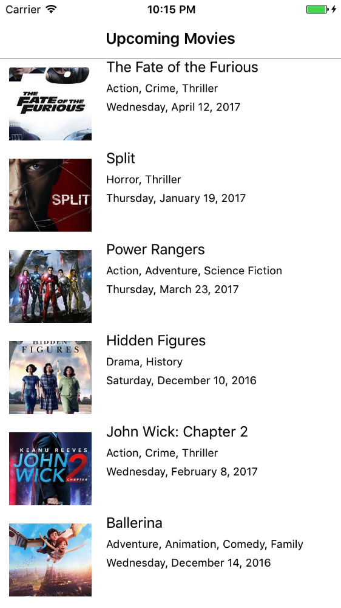

# Cinephile
An App that list the upcoming movies based on [The Movie DB](https://www.themoviedb.org)

Third-party libraries used:

- ReactiveUI: MVVM framework based on RFP.

- Xamarin.Froms: I decide to go with forms because it was the faster and simpler aproach here, I could invest much more time in the UI and improve it, but this wasn't my main concern here.

- Reactive Extensios: Set of extensios and classes to alow reactive funcional programming.

- Splat: Service Locator. The best reason why using a Service Locator instead of a IoC can be found in Paul Bets answer [here](http://stackoverflow.com/questions/26898381/reactiveui-view-viewmodel-injection-and-di-in-general)

- FFImageLoading: This library helps to reduce the memory usage of images downsampling them as needed, caching and using just one bitmap in memory when the same image is displayed multiple times.

- Akavache: Akavache will store the requests/reponses and use it as a cache for every request I make. If I repeat a request, he will get in the cache and queue an update

- Refit: It turns your REST API into a live interface. And reduces a lot the amount of code that you need to right to access an API.

- Fusillade: It' used to deduplicate requests, about the excessive amount of open connections and request prioritization.

- Nunit: Library to run the Unit Tests. I usually go with it, because it's supported inside the Xamarin Studio by default.

- Moq: Used to mock a few things, especially because we don' wanna Unit Tests trying to access any kind of network.
